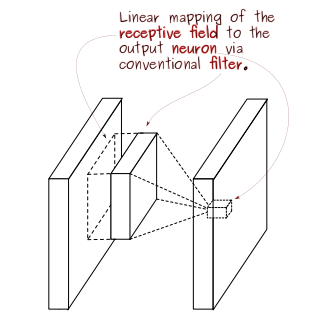
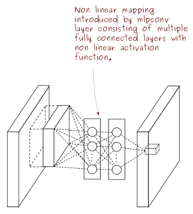

## Network In Network

* Link to paper: [https://arxiv.org/abs/1312.4400](https://arxiv.org/abs/1312.4400)
* Paper Published: Mar 2014 (v3)

This summary is part of [this repository](https://github.com/anandsaha/paper.summaries).

----

### TL;DR 
This paper had a new take on how the conv filters are designed and how we map features to class scores. This formed the basis of the Inception architure. Two new concepts were introduced in CNN architecture design:

* **mlpconv**: Replaces linear filters with non linear MLPs to extract better features within the receipt field. This helps in better abstraction and accuracy.
* **Global Average Pooling**: Got rid of the fully connected layers (reducing parameters and complexity) by creating as many activation maps in the last layer as there are classes. This is followed by averaging these maps to arrive at final scores, which is passed to softmax. This is performant and more intuitive.

### Motivation

* Traditional CNN architectures use linear filters to do the convolution and extract features out of images. The early layers try to extract primitive features like lines, edges and corners, while the later layers build on early layers and extract higher level features like eyes, ears, nose etc. These are called latent features. Now, there can be variations in each of those features - there can be many different variations in eyes alone. A linear filter tries to draw straight lines to discriminate these features. Thus conventional CNN implicitly makes the assumption that the latent concepts are linearly separable. But a straight line may not always fit. Using a richer non linear function approximator can serve better as a discriminator and extract better features.

  
   Fig. Linear convolution layer

* It is hard to understand how the usual fully connected layers seen at the end of CNN architectures map to category information. They are blackboxes between the convolution layers and the classifier. They are also prone to overfitting and come with lots of parameters to train.

### Solution

* **MLP Convolution Layers**:  asdf asf sadf sadf sadf asdf sadf sadf 

  
   Fig. MLP conv layer

 asdfasdfasdfasdff
